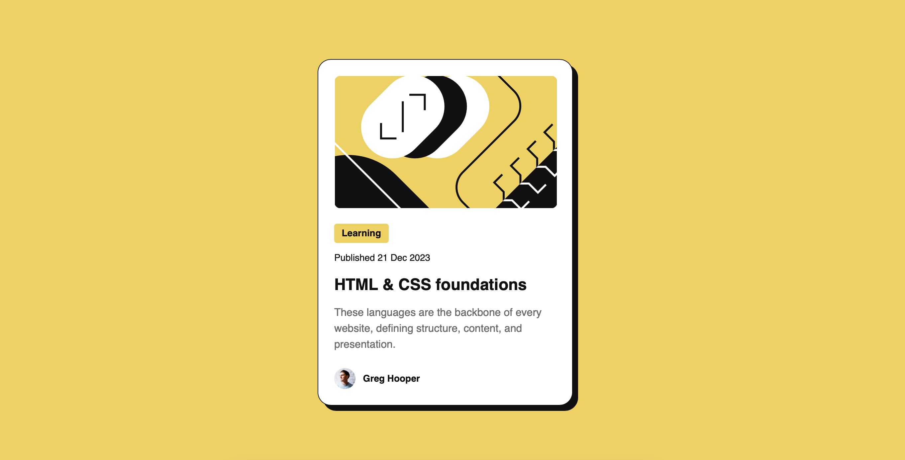

# Frontend Mentor - Blog preview card solution

This is a solution to the [Blog preview card challenge on Frontend Mentor](https://www.frontendmentor.io/challenges/blog-preview-card-ckPaj01IcS)

## Table of contents

- [Overview](#overview)
  - [Screenshot](#screenshot)
  - [Links](#links)
- [My process](#my-process)
  - [Built with](#built-with)
- [Author](#author)

## Overview

### Screenshot

### Links

- Solution URL: [GitHub](https://github.com/kvther1ne/blog-preview-card)
- Live Site URL: [GitHub Pages](https://your-live-site-url.com)

## My process

### Built with

- Semantic markup
- CSS custom properties
- Flexbox

## Author

- Website - [GitHub](https://github.com/kvther1ne)
- Frontend Mentor - [@kvther1ne](https://www.frontendmentor.io/profile/kvther1ne)
